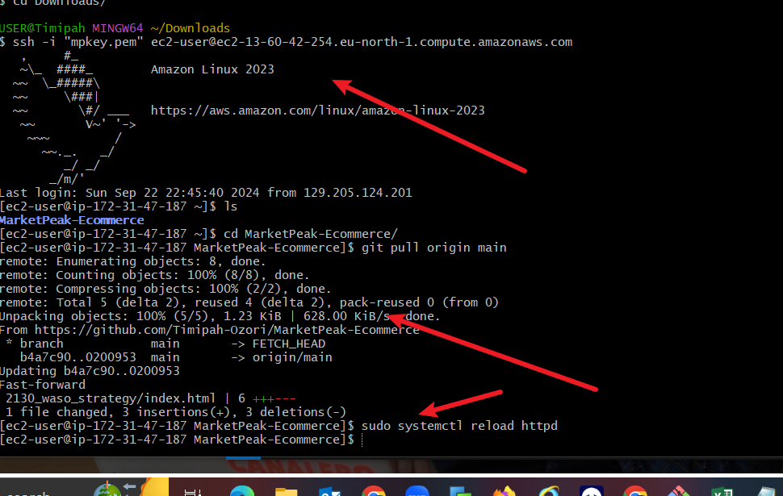

# Capstone-Project-introduction-to-cloudcomputing

## MarketPeak Ecommerce Website

Firstly a directory created and repository 

Downloaded file from free website template 

Git stage and first commit

Created a repository withour Readme file

Git Remote add and git push

Created an Amazon Linux instance 

SSH client details

Git cloned using the https url 

connected via ssh to instance 

Git clone 

Apache httpd installed earlier on Ec2 

Accessed the site using my public ip address 

Changed back to directory, created a new branch and switched to it 

Added new content to the image file 

New content in html file 

Added edited content 

git commit and push 

git merged development branch, pushed origin, got an error git pull to resolve and pushed again 

ssh to the Ec2 Instance and pull origin main 
